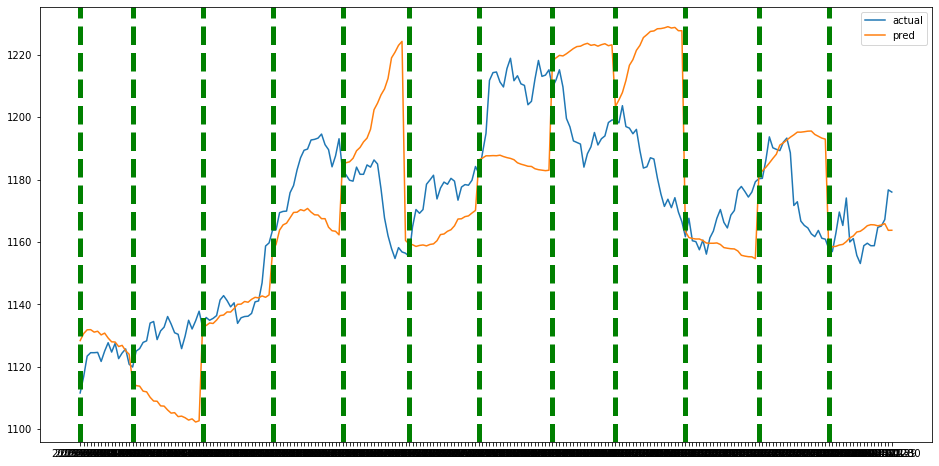

# project1

------------------------------------------------

1. prophet 정리   

-> facabook에서 제공하는 prophet 활용함.
-> [예측한 주가 추세](https://github.com/suminwooo/project1/blob/master/prophet1%20%EA%B0%9C%EB%B0%9C%ED%9B%84%20%EC%8B%9C%EA%B0%81%ED%99%94.ipynb)  
-> 실제값과 예측값의 RMSE가 차이가 많아서 추세로 확인해봄.  
-> RMSE뿐만 아니라 추세도 정확도가 좋지 않음.  

  - 5일간 상승, 하락 예상 -> 정확도 41.6%
  
| set01 | set02 | set03 | set04 |  set05 | set06 | set07 | set08 | set09 | set10 | set11 | set12 |   
| ---------- | :---------:| :----------: | ----------: |  ----------: | ----------: | ----------: | ----------: | ----------: | ----------: | ----------: | ----------: |
| 60% | 0% | 100% | 0% | 20% | 40% | 20% | 40% | 20% | 60% | 100% | 40% |  

  - 다음날 상승, 하락 예상 -> 정확도 25%

| set01 | set02 | set03 | set04 |  set05 | set06 | set07 | set08 | set09 | set10 | set11 | set12 |   
| ---------- | :---------:| :----------: | ----------: |  ----------: | ----------: | ----------: | ----------: | ----------: | ----------: | ----------: | ----------: |
| X | X | O | X | X | X | X | X | X | O | O | X |

  - 12개의 테스트 셋에 대해 그림으로 확인  
  

-----------------------------------------------

2. Arima 정리

-> prophet의 성능이 크게 좋지 않아서 추세만 확인하기 위해 arima모델을 사용함.    
-> 모델 자체의 구현이 간단한만큼 다양한 경우의 수를 생각하여 31개의 모델을 활용함.  
-> (0,0,0)~(5,1,5) 사이의 수를 활용하여 12개의 set에 모두 사용할수 있는 set은 12개.  
-> 이를 활용하여 실제값과 예측값이 다음날 맞을 확률, 5일 동안 추세가 맞을 확률을 구해봄.  
-> prophet보다는 좋은 성능을 보이지만, 여전히 50%를 넘지 못하는 한계가 존재한다.  

  - 5일간 상승, 하락 예상 -> 12개의 모델 평균  
  
| model1 | model2 | model3 | model4 |  model18 | model19 | model20 | model25 | model26 | model27 | model28 | model29 |     
| ---------- | :---------:| :----------: | ----------: |  ----------: | ----------: | ----------: | ----------: | ----------: | ----------: | ----------: | ----------: |  
| 36.67% | 36.67% | 36.67% |	33.33% |	38.33% |	40.00% |	35.00% |	40.00% |	36.67% |	33.33% |	36.67% |	35.00% |   
  
  - 5일간 평균 RMSE  
  
| model1 | model2 | model3 | model4 |  model18 | model19 | model20 | model25 | model26 | model27 | model28 | model29 |   
| ---------- | :---------:| :----------: | ----------: |  ----------: | ----------: | ----------: | ----------: | ----------: | ----------: | ----------: | ----------: |
| 8.345  |  8.361 | 8.157  |  8.241 | 8.696  |  8.121 |  8.097 | 8.504  | 8.266  | 8.262  | 8.278  | 8.283  | 
  
  - 다음날 상승, 하락 예상 -> 정확도 평균
  
| model1 | model2 | model3 | model4 |  model18 | model19 | model20 | model25 | model26 | model27 | model28 | model29 |   
| ---------- | :---------:| :----------: | ----------: |  ----------: | ----------: | ----------: | ----------: | ----------: | ----------: | ----------: | ----------: |
| 42.67% | 42.67% | 50% | 33.33% | 42.67% | 42.67% | 50% | 50% | 42.67% | 33.33% | 50% | 33.33% | 

----------------------------------------

2. DNN 정리

-> prophet과 arima모델을 사용함으로서 좋은 결과가 나타나지 않음.      
-> DNN 하이퍼 파라미터를 수정하면서 해볼예정.  
 

  ) set01만 활용하여 5일간 정확률 80%, RMSE=4.6으로 전체 11개(set01~set11)의 셋을 돌려봄.    

  
  - RMSE    
  
  
| set01 | set02 | set03 | set04 |  set05 | set06 | set07 | set08 | set09 | set10 | set11 |    
| ---------- | :---------:| :----------: | ----------: |  ----------: | ----------: | ----------: | ----------: | ----------: | ----------: | ----------: |
| 3.44 | 8.80 | 22.01 | 38.40 | 16.21 | 63.51 | 49.08 | 29.64 | 48.24 | 24.62 | 6.39 |  

  - 상승, 하락 예상(test set전체(한달), 5일, 다음날) -> 각각 확률 : 25%, 34.54%, 46.67%  
    
| 기준 | set01 | set02 | set03 | set04 |  set05 | set06 | set07 | set08 | set09 | set10 | set11 |     
| ---------- | :---------:| :----------: | ----------: |  ----------: | ----------: | ----------: | ----------: | ----------: | ----------: | ----------: | ----------: |
| 다음날 | X | O | X | X | X | X | X | X | O | O | X |    
| ---------- | :---------:| :----------: | ----------: |  ----------: | ----------: | ----------: | ----------: | ----------: | ----------: | ----------: | ----------: |
| 5일 | 60.0 % | 100.0 % | 40.0 % | 0.0 % | 80.0 % | 20.0 % | 0.0 % | 0.0 % | 20.0 % | 20.0 % | 40.0 % |  
| ---------- | :---------:| :----------: | ----------: |  ----------: | ----------: | ----------: | ----------: | ----------: | ----------: | ----------: | ----------: |
| 한달 | 40.0 % | 78.95 % | 30.0 % | 15.79 % | 77.78 % | 38.1 % | 35.0 % | 47.06 % | 35.0 % | 52.63 % | 63.16 % |  

  - 12개의 테스트 셋에 대해 그림으로 확인  
  
