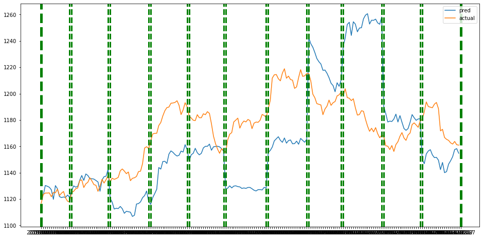

# project1

------------------------------------------------

1. prophet 정리   

-> facabook에서 제공하는 prophet 활용함.
-> [예측한 주가 추세](https://github.com/suminwooo/project1/blob/master/prophet1%20%EA%B0%9C%EB%B0%9C%ED%9B%84%20%EC%8B%9C%EA%B0%81%ED%99%94.ipynb)  
-> 실제값과 예측값의 RMSE가 차이가 많아서 추세로 확인해봄.  
-> RMSE뿐만 아니라 추세도 정확도가 좋지 않음.  

  - 5일간 상승, 하락 예상 -> 정확도 41.6%
  
| set01 | set02 | set03 | set04 |  set05 | set06 | set07 | set08 | set09 | set10 | set11 | set12 |   
| ---------- | :---------:| :----------: | ----------: |  ----------: | ----------: | ----------: | ----------: | ----------: | ----------: | ----------: | ----------: |
| 60% | 0% | 100% | 0% | 20% | 40% | 20% | 40% | 20% | 60% | 100% | 40% |  

  - 다음날 상승, 하락 예상 -> 정확도 25%

| set01 | set02 | set03 | set04 |  set05 | set06 | set07 | set08 | set09 | set10 | set11 | set12 |   
| ---------- | :---------:| :----------: | ----------: |  ----------: | ----------: | ----------: | ----------: | ----------: | ----------: | ----------: | ----------: |
| X | X | O | X | X | X | X | X | X | O | O | X |

  - 12개의 테스트 셋에 대해 그림으로 확인
  

-----------------------------------------------

2. Arima 정리

-> prophet의 성능이 크게 좋지 않아서 추세만 확인하기 위해 arima모델을 사용함.    
-> 모델 자체의 구현이 간단한만큼 다양한 경우의 수를 생각하여 31개의 모델을 활용함.  
-> (0,0,0)~(5,1,5) 사이의 수를 활용하여 12개의 set에 모두 사용할수 있는 set은 12개.  
-> 이를 활용하여 실제값과 예측값이 다음날 맞을 확률, 5일 동안 추세가 맞을 확률을 구해봄.  
-> prophet보다는 좋은 성능을 보이지만, 여전히 50%를 넘지 못하는 한계가 존재한다.  

  - 5일간 상승, 하락 예상 -> 12개의 모델 평균  
  
| model1 | model2 | model3 | model4 |  model18 | model19 | model20 | model25 | model26 | model27 | model28 | model29 |     
| ---------- | :---------:| :----------: | ----------: |  ----------: | ----------: | ----------: | ----------: | ----------: | ----------: | ----------: | ----------: |  
| 36.67% | 36.67% | 36.67% |	33.33% |	38.33% |	40.00% |	35.00% |	40.00% |	36.67% |	33.33% |	36.67% |	35.00% |   
  
  - 5일간 평균 RMSE  
  
| model1 | model2 | model3 | model4 |  model18 | model19 | model20 | model25 | model26 | model27 | model28 | model29 |   
| ---------- | :---------:| :----------: | ----------: |  ----------: | ----------: | ----------: | ----------: | ----------: | ----------: | ----------: | ----------: |
| 8.345  |  8.361 | 8.157  |  8.241 | 8.696  |  8.121 |  8.097 | 8.504  | 8.266  | 8.262  | 8.278  | 8.283  | 
  
  - 다음날 상승, 하락 예상 -> 정확도 평균
  
| model1 | model2 | model3 | model4 |  model18 | model19 | model20 | model25 | model26 | model27 | model28 | model29 |   
| ---------- | :---------:| :----------: | ----------: |  ----------: | ----------: | ----------: | ----------: | ----------: | ----------: | ----------: | ----------: |
| 42.67% | 42.67% | 50% | 33.33% | 42.67% | 42.67% | 50% | 50% | 42.67% | 33.33% | 50% | 33.33% | 

----------------------------------------

3. DNN 정리 : [기본코드](https://github.com/suminwooo/project1/blob/master/dnn.ipynb)

-> prophet과 arima모델을 사용함으로서 좋은 결과가 나타나지 않음.      
-> DNN 하이퍼 파라미터를 수정하면서 해볼예정.  
 

  set01만 활용하여 5일간 정확률 80%, RMSE=4.6으로 전체 11개(set01~set11)의 셋을 돌려봄.    

  
  - RMSE    
  
  
| set01 | set02 | set03 | set04 |  set05 | set06 | set07 | set08 | set09 | set10 | set11 |    
| ---------- | :---------:| :----------: | ----------: |  ----------: | ----------: | ----------: | ----------: | ----------: | ----------: | ----------: |
| 3.44 | 8.80 | 22.01 | 38.40 | 16.21 | 63.51 | 49.08 | 29.64 | 48.24 | 24.62 | 6.39 |  

  - 상승, 하락 예상(test set전체(한달), 5일, 다음날) -> 각각 확률 : 25%, 34.54%, 46.67%  
    
| 기준 | set01 | set02 | set03 | set04 |  set05 | set06 | set07 | set08 | set09 | set10 | set11 |     
| ---------- | :---------:| :----------: | ----------: |  ----------: | ----------: | ----------: | ----------: | ----------: | ----------: | ----------: | ----------: |
| 1일 | X | O | X | X | X | X | X | X | O | O | X |    
| 5일 | 60.0  | 100.0  | 40.0  | 0.0  | 80.0  | 20.0  | 0.0  | 0.0 | 20.0  | 20.0  | 40.0  |  
| 한달 | 40.0  | 78.95  | 30.0  | 15.79  | 77.78  | 38.1  | 35.0  | 47.06  | 35.0  | 52.63  | 63.16  |  

  - 12개의 테스트 셋에 대해 그림으로 확인->[만든 코드](https://github.com/suminwooo/project1/blob/master/dnn%20plot%20%EB%A7%8C%EB%93%A0%EC%BD%94%EB%93%9C.ipynb)    
  
  
  - 파라미터를 수정하며 돌린 결과-> [ 돌려본코드 ](https://github.com/suminwooo/project1/blob/master/DNN%20set01-%20set11%20%EB%8F%8C%EB%A6%B0%20%EC%BD%94%EB%93%9C.ipynb)
  
|모델	|	1층(유닛,활성함수,dropout,규제)	|	2층(유닛,활성함수,dropout,규제)|	3층(유닛,활성함수,dropout,규제)|	
| ---------- | :---------:| :----------: | ----------: |
|1번 	| 	1024, 0.1	|	128, 0.1 	|X|			
|2번 	| 	1024 relu, 0.1	|1024 relu, 0.1  	|X	|	
|3번 	| 	1024 relu, 0.2	|1024 relu, 0.1		|X	|
|4번 	| 	1024, 0.1	|	1024, 0.2		|1024,0.1 	|	
|5번 	| 	2048,0.2	|	1024, 0.2		|512,0.2 	 	|
|6번 |		512,0.2	|	512, 0.2	|	256,0.2  |
|7번 	|	1024,0.1	|	512, 0.1	|	256,0.1 |
|8번 |		1024,512	|	256, 0.1 	 	|X		|
|9번 	|	1024 softmax|	512		256,0.1  |X		|
|10번 |	1024,0.2	|	512, 0.2	|	256,0.2, l1=0.01  |
|11번 |	1024,0.1	|	512, 0.1	|	245,0.1, l2=0.01  |
|12번 |	1024, 0.1	|	512, 0.1, l2=0.01 |X			|
|13번 |	1024, 0.1	|	512, 0.1, l1=0.01	 	|X	|
|14번 |	1024,0.1	|	1024, 0.1  			|X|
  
| 기준 | model1 | model2 | model3 | model4 |  model5 | model6 | model7 | model8 | model9 | model10 | model11 | model12 | model13 | model14 |     
| ---------- | :---------:| :----------: | ----------: |  ----------: | ----------: | ----------: | ----------: | ----------: | ----------: | ----------: | ----------: | ----------: | ----------: | ----------: |    
| RMSE | 30.36 | 160.09 | 166.45 | 26.99 | 25.58 | 51.28 | 32.49 | 35.70 | 34.51 | 30.75 | 39.12 | 32.39 | 31.64 | 36.16 |    
| 5일 | 36.36 | 45.45 | 27.27 | 40 | 50.09 | 45.45 | 40 | 45.45 | 47.27 | 41.81 | 29.09 | 36.36 | 34.54 | 36.36 |  
| 한달 | 46.10 | 45.34 | 45.05 | 45.52 | 48.71 | 47.39 | 44.92 | 50.14 | 47.94 | 48.41 | 44.64 | 44.79 | 46.93 | 44.89 |  

  - 은닉층을 1층만 쌓거나, 활성함수를 변경하면 오히려 값이 안좋게 나오는 경향이 있음. 
  - 이를 통해 2층~3층 정도의 은닉층과 규제를 적절히 추가하는 법이 전체적으로 좋아지는 경향이 있음.
  - 업다운의 정확도 보다는 RMSE를 토대로 온라인 학습으로 그래프를 그려서 시각가 좋아 보임.

- 성능이 괜찮았던 모델들로 1년 train셋, 11개월 test셋으로 하여 모델을 돌려봄.  -> [ 모델 여러번 돌려린 그래프 ]https://github.com/suminwooo/project1/blob/master/dnn%20model%20plots.png

| 모델 |	RMSE |	전체 |	100일 |	50일	| 20일 |	10일 |	5일 |
| ---------- | :---------:| :----------: | ----------: | ---------- | :---------:| :----------: | ----------: |
|1-1번 |	14.36	|52.07%|	50%|	58%	|70%|	70%|	80%|
|1-2번	| 11.08	|58.99%	|56%	|66%	|65%|	60%	|80%|
|1-3번	|11.03|	59.99%|	54%|	62%|	70%|	60%|	80%|
|4-1번|	33.23	|45.16%|	39%|	38%|	35%|	40%|	20%|
|5-1번|	23.12	|51.15%	|51%|	62%	|70%|	60%	|60%|
|8-1번	|10.74	|57.6%|	53%	|64%|	75%	|70%|	80%|
|8-2번|	10.69	|57.6%|	50%|	60%	|60%	|60%|	80%|
|8-3번|	10.8	|61.29%	|56%|	66%	|65%|	60%	|80%|
|10번|	39.39	|45.16%	|39%|	38%	|35%|	40%	|20%|
